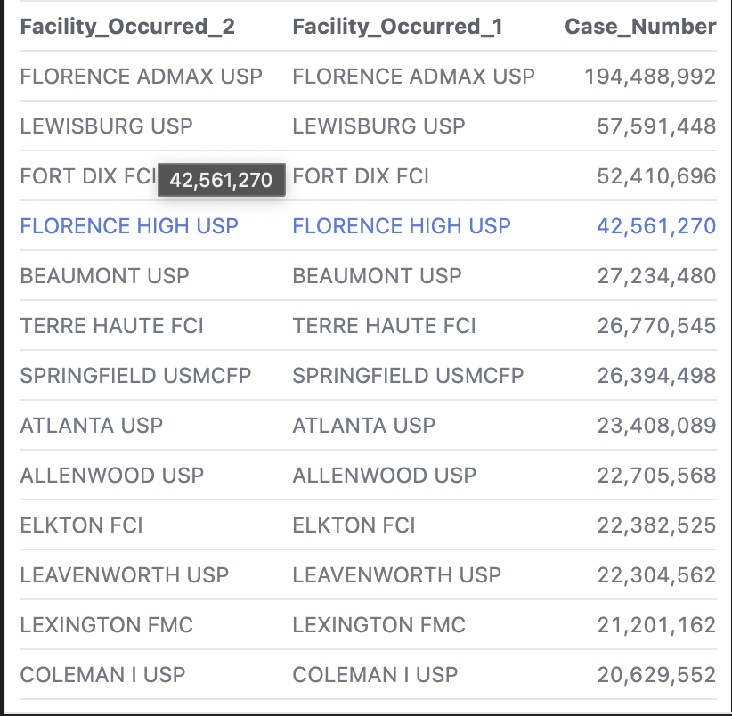
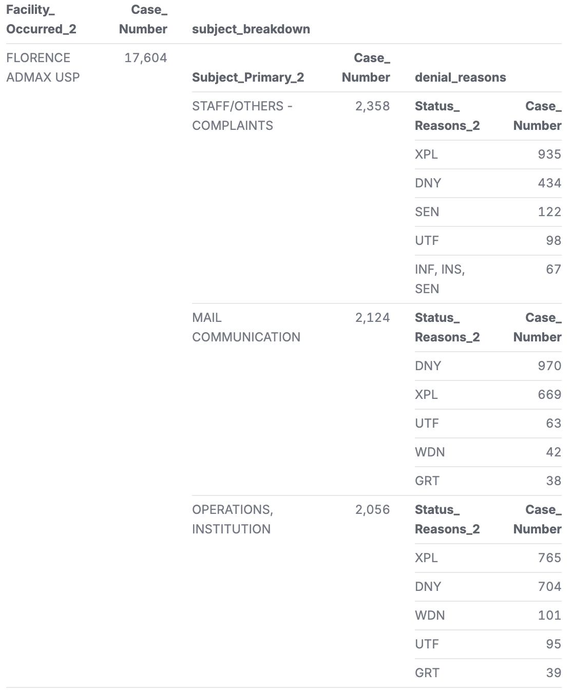

# Analysis of Federal Inmate Complaints
This analysis is done through data secured by the [Data Liberation Project](https://www.data-liberation-project.org/), via FOIA requests.

## Data
The raw [data] can be found in this document provided by the Data Liberation Project (https://docs.google.com/document/d/1vTuyUFNqS9tex4_s4PgmhF8RTvTb-uFMN5ElDjjVHTM/edit?tab=t.0). I have done analysis over these two decades of data trying to find any discrepencies.

## Summary
I thought this dataset was particularly interesting due to the common connotation of inmates being constantly mistreated and making the original philosophy of our prison system, reformation, void. My sister currently works at a Non-for-Profit legal company that works with these inmates and helps them through this complaint system. A few things of note that I learned from her: there was a bill passed that severely limited the amount of money that can be acquired by suing the Bureau of Prison(BOP) for misconduct. This made it so that any lawyers that look to take this work on (pro-bono of course due to their clients being in jail) cannot even recoup their expenses through the winnings of a suit which is the typically incentive behind pro-bono work. So, the amount of cases taken on significantly decreased leaving this population even more helpless against abuse. Another thing of note is the ability for inmates to communicate with lawyers and maintenance of attorney-client privilege. The only practical way of communication is through letters labeled as "legal letters"; even then, my sister tells me many of those letter are opened "to search for contraband", but very often read as well by the prison guards. This puts any inmates complaining about particular guards or abuse in danger of retaliation. The last thing of note that I took into my analysis was my sister detailed a few specific prisons where conditions and prisoner abuse were supposed to be worse than normal.

Going into my analysis: First I wanted to highlight the visualization of amount of complaints per prison from 2000-2010 . I thought this was very interesting since there was a very large disparity, and it wasn't one of the prisons my sister had listed. Later in my analysis, I identified various denial codes that represented simple Admin errors such as not the correct number of copies attached to the complaint filing or a missing signature on the document that highlighted additional difficulties and non-content related reasons to reject a complaint filing. I took these and broke them down by both facility and the subject of the complaint filing. This gave some interesting analysis that about half of the complaint filings about staff complaints were rejected due to this reasons at our most complained about facility, Florence ADMAX 
